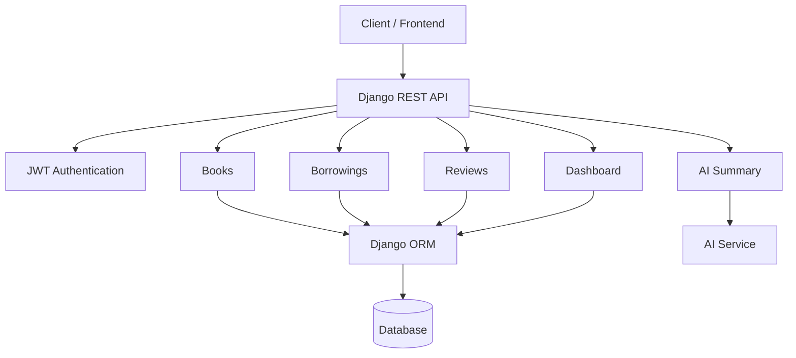
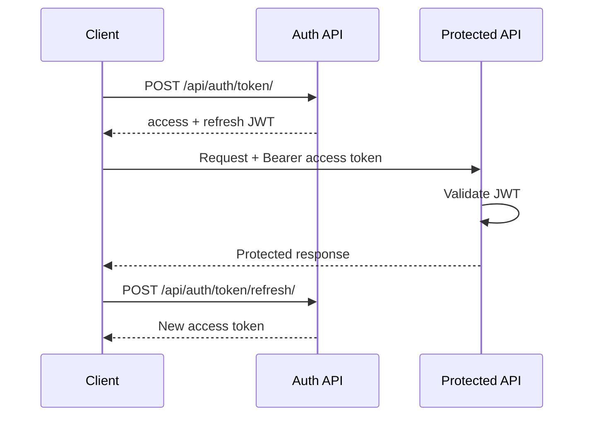
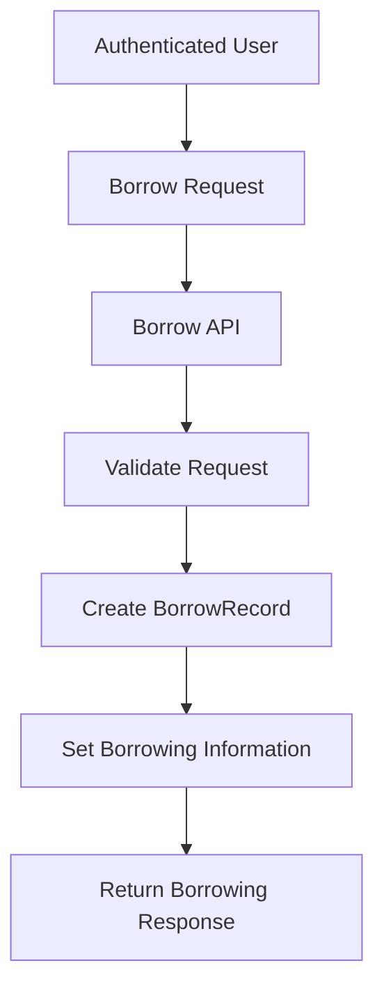
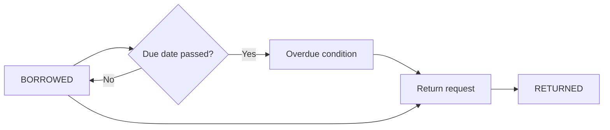
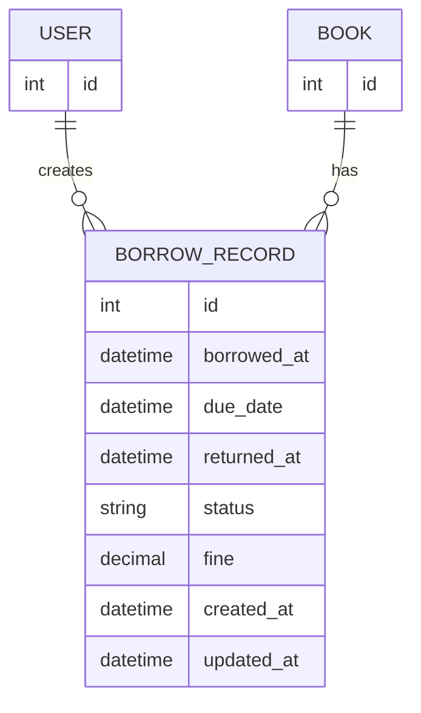

# E-Library Management System

> A modular RESTful backend for managing an e-library, built with Django and Django REST Framework.

The **E-Library Management System** is a backend engineering project designed around realistic library workflows rather than a simple CRUD application. It provides authenticated APIs for managing books, borrowing and returning books, borrowing history, overdue records, reviews, user dashboards, and AI-powered book summaries.

The project also includes JWT authentication, OpenAPI/Swagger documentation, environment-based configuration, Django Admin support, and a domain-oriented multi-app architecture.

---

## Table of Contents

- [Overview](#overview)
- [Key Features](#key-features)
- [Architecture](#architecture)
- [Tech Stack](#tech-stack)
- [Project Structure](#project-structure)
- [Authentication](#authentication)
- [Book Management](#book-management)
- [Borrowing System](#borrowing-system)
- [Overdue and Fine Handling](#overdue-and-fine-handling)
- [Book Reviews](#book-reviews)
- [AI Book Summary](#ai-book-summary)
- [User Dashboard](#user-dashboard)
- [API Reference](#api-reference)
- [Typical API Workflow](#typical-api-workflow)
- [Data Model](#data-model)
- [Environment Configuration](#environment-configuration)
- [Local Setup](#local-setup)
- [API Documentation](#api-documentation)
- [Testing](#testing)
- [Security](#security)
- [Design Decisions](#design-decisions)
- [Future Improvements](#future-improvements)
- [Author](#author)

---

## Overview

The system exposes a REST API through which authenticated users can interact with the library.

### Core user journey

```text
                    ┌──────────────────────┐
                    │       Client         │
                    └──────────┬───────────┘
                               │
                               ▼
                    ┌──────────────────────┐
                    │     Django REST      │
                    │        API           │
                    └──────────┬───────────┘
                               │
          ┌────────────────────┼────────────────────┐
          │                    │                    │
          ▼                    ▼                    ▼
   ┌─────────────┐      ┌─────────────┐      ┌─────────────┐
   │    Users    │      │    Books    │      │  Borrowing  │
   └─────────────┘      └─────────────┘      └──────┬──────┘
                                                     │
                                                     ▼
                                             ┌─────────────┐
                                             │  History /  │
                                             │   Overdue   │
                                             └──────┬──────┘
                                                    │
                                                    ▼
                                             ┌─────────────┐
                                             │   Return /  │
                                             │    Fine     │
                                             └─────────────┘

                         ┌────────────────────────────┐
                         │       Other Services       │
                         │ Reviews • Dashboard • AI   │
                         └────────────────────────────┘
```

---

## Key Features

| Feature | Description |
|---|---|
| JWT Authentication | Secure API authentication using access and refresh tokens |
| Book Management | Create, list, retrieve, update, partially update and delete books |
| Book Search | Search books through the API query parameter |
| Borrowing | Authenticated users can borrow books |
| Borrowing History | Users can retrieve their borrowing records |
| Overdue Tracking | Dedicated endpoint for overdue borrowing records |
| Book Return | Users can return borrowed books |
| Fine Support | Borrowing records maintain a monetary fine field |
| Reviews | API endpoints for retrieving and creating reviews |
| AI Summary | Generate an AI-powered summary for a specific book |
| Dashboard | User/library-related dashboard information |
| API Documentation | OpenAPI schema and Swagger UI |
| Environment Configuration | `.env` and `.env.example` based configuration |
| Django Admin | Administrative management through Django Admin |

---

# Architecture

The project follows Django's modular application structure, separating different business domains into independent apps.



### Request flow

```text
Client
  │
  │ HTTP Request
  ▼
Django URL Router
  │
  ▼
View / APIView
  │
  ├── Authentication / Permissions
  │
  ├── Serializer Validation
  │
  ├── Business Logic
  │
  └── Django ORM
          │
          ▼
       Database
```

This keeps authentication, validation, API handling and persistence separated into appropriate layers.

---

# Tech Stack

| Layer | Technology |
|---|---|
| Language | Python |
| Backend Framework | Django |
| REST API | Django REST Framework |
| Authentication | JWT / `djangorestframework-simplejwt` |
| API Specification | OpenAPI 3 |
| API Documentation | Swagger UI / DRF Spectacular |
| ORM | Django ORM |
| Local Database | SQLite (development configuration) |
| Configuration | Environment variables / `.env` |
| Development Server | Django development server |

---

# Project Structure

The project is organized into domain-specific Django applications.

```text
e-library/
│
├── books/
│   ├── migrations/
│   ├── models.py
│   ├── serializers.py
│   ├── views.py
│   ├── urls.py
│   ├── admin.py
│   └── tests.py
│
├── borrowings/
│   ├── migrations/
│   ├── models.py
│   ├── serializers.py
│   ├── views.py
│   ├── urls.py
│   ├── admin.py
│   └── tests.py
│
├── users/
│
├── reviews/
│
├── dashboard/
│
├── favourites/
│
├── notifications/
│
├── reservations/
│
├── config/
│   ├── settings.py
│   ├── urls.py
│   ├── asgi.py
│   └── wsgi.py
│
├── manage.py
├── requirements.txt
├── .env.example
├── .gitignore
└── README.md
```

> The domain apps make it easier to maintain and extend the system as additional library functionality is added.

---

# Authentication

The API uses **JWT-based authentication**.

Two token endpoints are available:

| Method | Endpoint | Purpose |
|---|---|---|
| POST | `/api/auth/token/` | Obtain access and refresh tokens |
| POST | `/api/auth/token/refresh/` | Obtain a new access token using a refresh token |

## Authentication flow



### Example: obtain JWT

```http
POST /api/auth/token/
Content-Type: application/json
```

```json
{
  "email": "user@example.com",
  "password": "your-password"
}
```

Example response:

```json
{
  "refresh": "<refresh-token>",
  "access": "<access-token>"
}
```

Use the access token for protected endpoints:

```http
Authorization: Bearer <access-token>
```

### Important

Never commit the following to GitHub:

- `.env`
- JWT access/refresh tokens
- passwords
- API keys
- Django secret keys

---

# Book Management

Books are the central entity of the library system.

The API supports the standard book management operations:

| Method | Endpoint | Purpose |
|---|---|---|
| GET | `/api/` | List/search books |
| POST | `/api/` | Create a book |
| GET | `/api/{id}/` | Retrieve a specific book |
| PUT | `/api/{id}/` | Replace a book |
| PATCH | `/api/{id}/` | Partially update a book |
| DELETE | `/api/{id}/` | Delete a book |

## Search

Book search is available using the `search` query parameter.

Example:

```http
GET /api/?search=Rahul
```

This allows clients to retrieve books matching the implemented search behavior.

---

# Borrowing System

Borrowing is implemented as a separate domain through the `borrowings` application.

A borrowing is represented by a `BorrowRecord`.

## BorrowRecord

The implemented record contains:

| Field | Purpose |
|---|---|
| `user` | User associated with the borrowing |
| `book` | Book being borrowed |
| `borrowed_at` | Timestamp when borrowing was created |
| `due_date` | Expected return date/time |
| `returned_at` | Actual return timestamp, when returned |
| `status` | Current borrowing state |
| `fine` | Fine amount associated with the borrowing |
| `created_at` | Record creation timestamp |
| `updated_at` | Last update timestamp |

### Status values

```text
BORROWED
   │
   │ due date passes
   ▼
OVERDUE
   │
   │ book returned
   ▼
RETURNED
```

The model defines the following status choices:

```text
BORROWED
RETURNED
OVERDUE
```

---

## Borrow Workflow

Endpoint:

```http
POST /api/borrowings/borrow/
```

High-level flow:



The exact validation and business rules are determined by the current implementation.

---

# Borrowing History

Endpoint:

```http
GET /api/borrowings/history/
```

This endpoint provides the authenticated user's borrowing history.

Depending on the serializer response, borrowing information can include:

- Book
- Borrowed timestamp
- Due date
- Returned timestamp
- Status
- Fine

The API uses the project's serializer as the source of truth for the exact response structure.

---

# Overdue and Fine Handling

Endpoint:

```http
GET /api/borrowings/overdue/
```

The `BorrowRecord` model contains an `is_overdue` property.

The implemented condition is:

```python
return (
    self.status == self.Status.BORROWED
    and timezone.now() > self.due_date
)
```

Therefore, an active borrowing is considered overdue when:

1. Its status is `BORROWED`
2. The current time has passed `due_date`

### Important distinction

`is_overdue` is a property that evaluates whether a borrowing has passed its due date. It should not automatically be interpreted as an automatic database status transition unless the current business logic explicitly performs that transition.

---

# Returning a Book

Endpoint:

```http
POST /api/borrowings/return/{id}/
```

The return workflow operates on a borrowing record.

Relevant fields include:

- `returned_at`
- `status`
- `fine`

Typical lifecycle:



The exact return-time fine calculation and any book availability update are determined by the implementation.

---

# Fine Management

Each borrowing record contains a decimal fine field:

```python
fine = models.DecimalField(
    max_digits=10,
    decimal_places=2,
    default=0
)
```

This provides a dedicated monetary value for fines.

> The README intentionally does not assume a particular daily-fine formula. The actual return/business logic is the source of truth for how the value is calculated or updated.

---

# Book Reviews

The project includes a `reviews` application.

Available endpoints:

| Method | Endpoint | Purpose |
|---|---|---|
| GET | `/api/reviews/` | Retrieve reviews |
| POST | `/api/reviews/` | Create a review |

The exact review fields, validation rules and user/book relationships are defined by the corresponding model, serializer and view implementation.

---

# AI Book Summary

The project includes an AI-powered book summary endpoint.

```http
POST /api/{id}/summary/
```

## High-level workflow

```mermaid
flowchart TD
    A[Authenticated Client] --> B[POST /api/{id}/summary/]
    B --> C[Retrieve Book]
    C --> D[Prepare Summary Input]
    D --> E[AI Service]
    E --> F[Generated Summary]
    F --> G[JSON API Response]
```

### Request lifecycle

```text
1. Client authenticates
        ↓
2. Client requests summary for a book
        ↓
3. Backend identifies the requested book
        ↓
4. Backend prepares the information used for summarization
        ↓
5. AI service generates the summary
        ↓
6. Backend returns the generated result
```

The exact AI provider, model and configuration are intentionally not hard-coded in this README; they should be taken from the project's current environment configuration and implementation.

### Example

```http
POST /api/1/summary/
Authorization: Bearer <access-token>
```

Example response shape:

```json
{
  "summary": "Generated summary..."
}
```

> The exact response fields should be verified against the current serializer/view implementation.

---

# User Dashboard

Endpoint:

```http
GET /api/dashboard/
```

The dashboard provides user/library-related information through a dedicated API endpoint.

This keeps dashboard aggregation separate from the core book and borrowing APIs.

---

# API Reference

## Authentication

| Method | Endpoint | Auth | Description |
|---|---|---|---|
| POST | `/api/auth/token/` | No | Obtain JWT access and refresh tokens |
| POST | `/api/auth/token/refresh/` | No | Refresh an access token |

## Books

| Method | Endpoint | Auth | Description |
|---|---|---|---|
| GET | `/api/` | Yes | List/search books |
| POST | `/api/` | Yes | Create a book |
| GET | `/api/{id}/` | Yes | Get a book |
| PUT | `/api/{id}/` | Yes | Replace a book |
| PATCH | `/api/{id}/` | Yes | Partially update a book |
| DELETE | `/api/{id}/` | Yes | Delete a book |

## AI Summary

| Method | Endpoint | Auth | Description |
|---|---|---|---|
| POST | `/api/{id}/summary/` | Yes | Generate a summary for a book |

## Borrowings

| Method | Endpoint | Auth | Description |
|---|---|---|---|
| POST | `/api/borrowings/borrow/` | Yes | Borrow a book |
| GET | `/api/borrowings/history/` | Yes | View borrowing history |
| GET | `/api/borrowings/overdue/` | Yes | View overdue records |
| POST | `/api/borrowings/return/{id}/` | Yes | Return a borrowing |

## Dashboard

| Method | Endpoint | Auth | Description |
|---|---|---|---|
| GET | `/api/dashboard/` | Yes | Retrieve dashboard information |

## Reviews

| Method | Endpoint | Auth | Description |
|---|---|---|---|
| GET | `/api/reviews/` | Yes | Retrieve reviews |
| POST | `/api/reviews/` | Yes | Create a review |

---

# Example API Workflow

A realistic end-to-end interaction looks like this:

```text
┌──────────────────────────┐
│ 1. Authenticate          │
│ POST /auth/token/        │
└────────────┬─────────────┘
             │
             ▼
┌──────────────────────────┐
│ 2. Receive JWT           │
│ access + refresh         │
└────────────┬─────────────┘
             │
             ▼
┌──────────────────────────┐
│ 3. Browse/Search Books   │
│ GET /api/?search=...     │
└────────────┬─────────────┘
             │
             ▼
┌──────────────────────────┐
│ 4. View Book             │
│ GET /api/{id}/           │
└────────────┬─────────────┘
             │
             ├──────────────────────────┐
             ▼                          ▼
┌──────────────────────────┐   ┌──────────────────────────┐
│ 5. Borrow                │   │ AI Summary               │
│ POST /borrowings/borrow/ │   │ POST /{id}/summary/      │
└────────────┬─────────────┘   └──────────────────────────┘
             │
             ▼
┌──────────────────────────┐
│ 6. Track Borrowing       │
│ history / overdue        │
└────────────┬─────────────┘
             │
             ▼
┌──────────────────────────┐
│ 7. Return Book           │
│ POST /return/{id}/       │
└────────────┬─────────────┘
             │
             ▼
┌──────────────────────────┐
│ 8. Review / Dashboard    │
└──────────────────────────┘
```

---

# Data Model

At the core of the borrowing domain:



The central relationship is:

```text
User
  │
  │ 1
  │
  │ N
  ▼
BorrowRecord
  │
  │ N
  │
  │ 1
  ▼
Book
```

This allows the system to represent multiple borrowing records for users and books over time.

---

# Environment Configuration

The project includes:

```text
.env
.env.example
```

Use `.env.example` as the configuration template and keep the real `.env` file outside version control.

Example workflow:

```powershell
Copy-Item .env.example .env
```

Then populate the required values.

> Use the exact variable names already present in `.env.example`. Do not commit real secrets.

---

# Local Setup

## 1. Clone the repository

```bash
git clone https://github.com/rahulcmca25-hub/e-library-backend.git
cd e-library-backend
```

## 2. Create a virtual environment

```bash
python -m venv venv
```

### Windows PowerShell

```powershell
venv\Scripts\Activate.ps1
```

## 3. Install dependencies

```bash
pip install -r requirements.txt
```

## 4. Configure environment variables

```powershell
Copy-Item .env.example .env
```

Fill in the required values from `.env.example`.

## 5. Apply migrations

```bash
python manage.py migrate
```

## 6. Create an admin user

```bash
python manage.py createsuperuser
```

## 7. Start the development server

```bash
python manage.py runserver
```

The development server will normally be available at:

```text
http://127.0.0.1:8000/
```

---

# API Documentation

The project exposes interactive API documentation.

### Swagger UI

```text
http://127.0.0.1:8000/api/docs/
```

### OpenAPI Schema

```text
http://127.0.0.1:8000/api/schema/
```

Swagger is particularly useful for:

- discovering available endpoints
- viewing request parameters
- testing API operations
- understanding authentication requirements
- inspecting API responses

---

# Testing

Django tests can be executed with:

```bash
python manage.py test
```

The repository contains test modules inside the Django applications.

For a production-ready project, test coverage can be expanded around:

- authentication
- permissions
- book CRUD
- search
- borrowing validation
- returning books
- overdue handling
- fine calculation
- reviews
- dashboard aggregation
- AI-service failure scenarios

---

# Security

Security considerations implemented/used by the project include:

### JWT Authentication

Protected APIs require a valid JWT access token.

```http
Authorization: Bearer <access-token>
```

### Environment-based secrets

Sensitive configuration should live in `.env` rather than source code.

### Git protection

The real `.env` file should remain excluded through `.gitignore`.

### Token handling

JWT tokens should never be committed to GitHub or embedded in README examples.

### API permissions

Protected API views use authentication/permission mechanisms such as `IsAuthenticated`.

---

# Error Handling

The API follows standard HTTP response semantics where applicable.

Common categories include:

| Status | Meaning |
|---|---|
| `200 OK` | Successful request |
| `201 Created` | Resource successfully created |
| `400 Bad Request` | Invalid request/data |
| `401 Unauthorized` | Missing or invalid authentication |
| `404 Not Found` | Requested resource does not exist |

One authentication error exposed by the API is:

```json
{
  "detail": "Authentication credentials were not provided."
}
```

The exact response body depends on the endpoint and validation path.

---

# Design Decisions

## 1. Domain-based Django apps

Instead of putting all functionality into one large application, the system separates domains such as:

```text
books
borrowings
reviews
users
dashboard
...
```

This makes the codebase easier to understand and extend.

## 2. Django REST Framework

DRF provides:

- serializers
- API views
- authentication
- permissions
- request/response handling
- API-friendly validation

## 3. JWT authentication

JWT provides a stateless authentication mechanism suitable for REST APIs.

The access/refresh model also allows short-lived access tokens to be renewed without requiring the user to authenticate again every time.

## 4. Dedicated borrowing domain

Borrowing is separated from books because borrowing contains its own business state:

```text
borrowed_at
due_date
returned_at
status
fine
```

This is more representative of a real library system than simply storing an `is_borrowed` flag on a book.

## 5. Dedicated AI endpoint

AI summarization is exposed as a dedicated endpoint:

```text
POST /api/{id}/summary/
```

This keeps AI-related processing separate from standard book CRUD operations.

## 6. OpenAPI documentation

Swagger/OpenAPI makes the backend easier to inspect, test and integrate with a frontend client.

---

# Example: Search for a Book

```http
GET /api/?search=Rahul
Authorization: Bearer <access-token>
```

Conceptually:

```text
Client
  │
  │ GET /api/?search=Rahul
  ▼
Book API
  │
  ▼
Search / Query Logic
  │
  ▼
Book Serializer
  │
  ▼
JSON Response
```

---

# Example: Borrow a Book

```http
POST /api/borrowings/borrow/
Authorization: Bearer <access-token>
Content-Type: application/json
```

The exact request body should be taken from the borrowing serializer/API implementation.

Conceptual workflow:

```text
Authenticated User
        │
        ▼
Borrow Request
        │
        ▼
Validation
        │
        ▼
BorrowRecord
        │
        ├── user
        ├── book
        ├── borrowed_at
        ├── due_date
        ├── status
        └── fine
```

---

# Example: Generate an AI Summary

```http
POST /api/1/summary/
Authorization: Bearer <access-token>
```

Conceptual flow:

```text
Book ID
   │
   ▼
Book Retrieval
   │
   ▼
Summary Input
   │
   ▼
AI Provider
   │
   ▼
Generated Summary
   │
   ▼
JSON Response
```

---

# API Capability Map

```text
                         E-LIBRARY API
                              │
       ┌──────────────────────┼──────────────────────┐
       │                      │                      │
       ▼                      ▼                      ▼
 Authentication            Books                Borrowings
       │                      │                      │
       │                 ┌────┼────┐          ┌──────┼──────┐
       │                 │    │    │          │      │      │
       ▼                 ▼    ▼    ▼          ▼      ▼      ▼
    JWT Token           List Create Detail   Borrow History Overdue
    Refresh             Update Delete Search       │
                                                     ▼
                                                   Return
                                                     │
                                                     ▼
                                                    Fine

       ┌──────────────────────┼──────────────────────┐
       │                      │                      │
       ▼                      ▼                      ▼
    Reviews               Dashboard              AI Summary
```

---

# Future Improvements

The following are potential production improvements and are **not presented as currently implemented features**:

- PostgreSQL for production
- Redis caching
- Celery/background jobs
- automated overdue notifications
- email notifications
- reservation queue management
- API rate limiting
- pagination
- advanced filtering
- full-text search
- recommendation engine
- AI-powered semantic search
- Docker
- CI/CD
- production deployment
- expanded automated test coverage
- centralized logging and monitoring
- role-based permissions
- audit logs

These improvements would help the project scale from an assignment-level backend into a production-oriented library platform.

---

# What Makes This Project More Than Basic CRUD?

The project goes beyond a simple collection of CRUD endpoints by introducing domain workflows and backend concerns such as:

- authenticated access
- JWT token lifecycle
- borrowing records
- due dates
- overdue detection
- return lifecycle
- fine representation
- review APIs
- dashboard aggregation
- AI-assisted functionality
- environment-based configuration
- OpenAPI documentation
- modular Django application architecture

The borrowing domain in particular models a real business workflow rather than treating a book as only a database record.

---

# Production Considerations

For a production deployment, the system could be extended with:

```text
                         Production Backend
                                │
             ┌──────────────────┼──────────────────┐
             ▼                  ▼                  ▼
        PostgreSQL            Redis             Celery
             │                  │                  │
             └──────────────────┼──────────────────┘
                                ▼
                         Django REST API
                                │
                 ┌──────────────┼──────────────┐
                 ▼              ▼              ▼
              Auth           Library          AI
                 │              │              │
                 └──────────────┼──────────────┘
                                ▼
                         Monitoring / Logs
```

Potential production work includes asynchronous jobs, caching, rate limiting, stronger observability, CI/CD and automated integration testing.

---

# License

This project was developed as a backend assignment/project submission.

---

# Author

**Rahul Chadar**

GitHub:  
https://github.com/rahulcmca25-hub

Repository:  
https://github.com/rahulcmca25-hub/e-library-backend

---

## Final Note

This README describes the backend capabilities and API surface provided for the project. Where an implementation detail depends on the current serializer, view or environment configuration, the repository source code remains the final source of truth.
